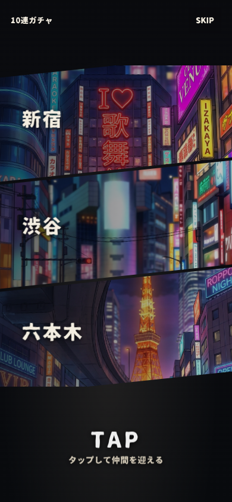
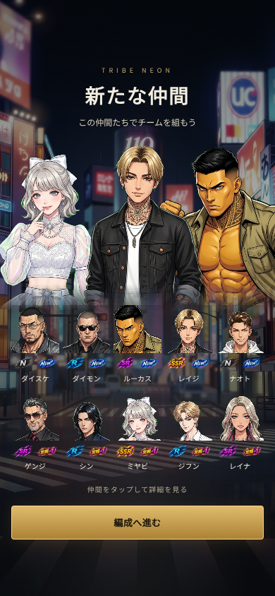
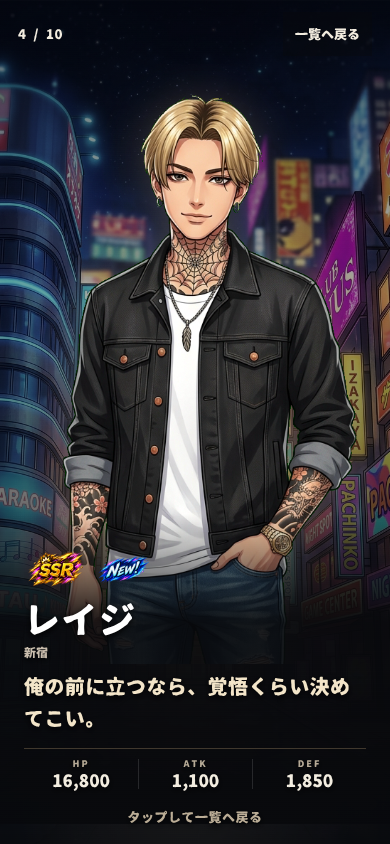

# キャラクターガチャ「合流」演出

2026-09-08。PR #28のカード演出を、ユーザー承認済みのキャラクター主体の合流演出へ更新。

## 今回の変更

- 追加修正: CSS削除時に誤結合した登場画面セレクタを復旧。全レアリティで全画面の高さ・幅を確保し、立ち絵と情報欄の配置を戻した。モバイル幅2種類で寸法と立ち絵の露出領域を回帰検証する。
- 書体は日本語ゴシック（iOSはヒラギノ）、街名・キャラ名は太字、英数字はArialへ調整。明示色とappearance指定でiOSのボタン既定色・外観を抑制。

- キャラクター画像は既存立ち絵のみ。描き起こし・ポーズ変更なし。
- 導入は既存背景を横長に切り抜き、街名と斜めスライド。前半4街（池袋・秋葉原・川崎・横浜）→後半3街（新宿・渋谷・六本木）、計3秒後にTAPを表示・有効化。最後の3街で停止し、SKIPは常時利用可能。reduced motionでは最終3街を静止表示する。
- 既存のレアリティ・NEW・覚醒段階バッジを再利用。覚醒は結果が持つ実段階を表示し、進捗増加を段階上昇として扱わない。
- NEW・覚醒の重複テキストは撤去し、既存NEW／＋1〜＋5バッジに統一。画像取得失敗時の文字結果と読み上げ情報は保持する。
- SSRの追加光・発光・拡大演出を撤去。FIX済みセリフを残し、350msの短いフェードで立ち絵に切り替える。通常の登場SEは維持。
- カード裏面・扇状配置・金属フレームを撤去。登場は顔・表情を大きく見せ、名前と確定セリフを重視。
- 一覧上部は獲得した仲間の立ち絵から最大3人を表示（最高レアリティを中央）。下の10件は取得順を保った5列2行の顔一覧。
- タップで演出完了、次タップで次へ、SKIP、人物の再表示、編成CTAは維持。
- 全60体のFIXセリフ、抽選RPC・確率・消費・報酬・サーバー進行に変更なし。

## 読み込み修正

人物だけ・背景だけが先行することを防ぐため、立ち絵・7街背景・既存バッジの先読みとデコードをまとめて待つ。
さらに実際に表示するDOMの画像もデコード完了まで画面を非表示にし、登場・セリフのタイマーを停止する。
これによりブラウザーが先読み画像を再取得する場合も、完成した画面を一括表示する。
12秒で画像準備を打ち切り、画像だけの再読み込みを案内。待機中・取得失敗時も獲得結果を文字で確認できる。再抽選はしない。

## 確認結果

- Next.js preview設定の本番ビルド・TypeScript・実装ESLintエラーなし。
- 既存SSR10体および全60体セリフのマスタチェック成功。
- Playwright 9件成功: キャラ1回／10回、390×844／320×568、取得順、詳細、編成への遷移、再実行、SSR文字送り・切り替え・バッジ、SKIP、連打、N/R/SRの連続紹介、reduced motion、キーボード、初回画像遅延、背景取得失敗と再試行・文字結果。
- 画面撮影時のJavaScriptエラー0・欠落画像0。撮影時のみ日本語フォントを追加（アプリ依存関係への追加なし）。
- 実機Safari・実音声・本番抽選はユーザー確認待ち。本番未反映。

QA URLのパス: `/qa/presentation?scenario=gacha-character-v3`
`single=true` / `rarity=N|R|SR|SSR` / `tutorial=false` で単発・レアリティ・通常ガチャを確認可能。
本番では従来どおりQAページは404。

## 使用画像素材

背景は既存の `public/bg/bg_street_*.jpg` の7街、キャラは既存立ち絵、バッジは `public/ui/rarity/` を使用。
前案の `public/gacha/arrival/tokyo-alley.webp` は今回の演出では使用しない。新しいキャラクター画像・ポーズ・カードフレームは追加しない。

